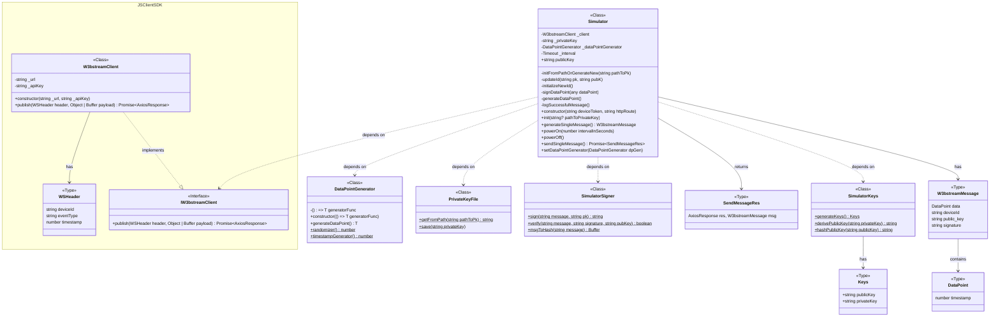

# Simulator README

This README provides an overview of the Simulator module, which is designed to generate and send simulated data points to the W3BSTREAM server.

## Table of Contents

- Getting Started
- Usage
  - [Message Generator](#create-message-generator)
  - [Initialization](#simulator-initialization)
  - [Sending Messages](#sending-messages)

## Getting Started

To use the Simulator module, you need to import it along with some dependencies:

```javascript
import {
  Simulator,
  DataPointGenerator,
} from "@w3bstream/w3bstream-http-client-simulator";
```

And provide DEVICE_TOKEN and HTTP_ROUTE that can be found in W3bstream project.

```javascript
const deviceToken = "DEVICE_TOKEN";
const httpRoute = "HTTP_ROUTE";
```

## Usage

### Create message generator

Deside what the shape of the data point should be:

```javascript
type TemperatureDataPoint = {
  temperature: number;
  timestamp: number;
};
```

And how the data point should be generated, you can use `randomizer` or `timestampGenerator` methods of DataPointGenerator: 

```javascript
const generatorFunction = () => ({
  temperature: DataPointGenerator.randomizer(0, 100),
  timestamp: DataPointGenerator.timestampGenerator(),
});
```

And finally, to generate messages, instantiate data generator:

```javascript
const dataGenerator = new DataPointGenerator<TemperatureDataPoint>(
  generatorFunction
);
```

### Simulator initialization

Create a new instance of the `Simulator` class, initialize it and set a `DataPointGenerator` that you created earlier:

```javascript
const simulator = new Simulator(deviceToken, httpRoute);
simulator.init();
simulator.dataPointGenerator = dataGenerator;
```

You can also provide an optional `pathToPrivateKey` parameter:

```javascript
simulator.init(pathToPrivateKey);
```

Now you can generate a message with a single or multiple events:

```javascript
const message = simulator.generateEvents(numberOfDataPoints);
```

### Sending Messages

To send a single message to the server, call the `sendSingleMessage` method:

```javascript
const { res, msg } = await simulator.sendSingleMessage();

console.log("response: ", res?.data);
console.log("w3bstream message: ", msg);
```

To send messages at a specified interval, use the `powerOn` method:

```javascript
simulator.powerOn(intervalInSec);
```

To stop sending messages, call the `powerOff` method:

```javascript
simulator.powerOff();
```

