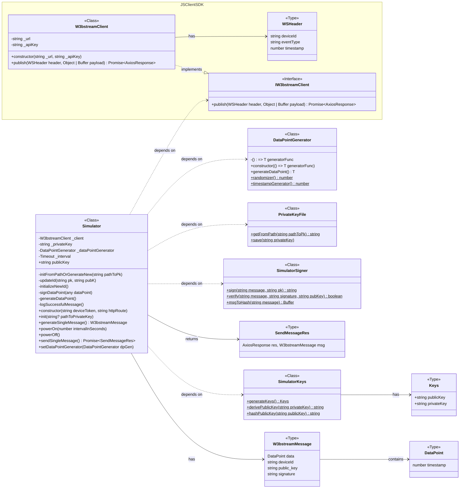

```mermaid
classDiagram
    direction LR
    namespace JSClientSDK {
        class WSHeader {
                <<Type>>
                string deviceId
                string eventType
                number timestamp
        }
        class IW3bstreamClient {
            <<Interface>>
            +publish(WSHeader header, Object | Buffer payload) Promise~AxiosResponse~
        }

        class W3bstreamClient {
            <<Class>>
            -string _url
            -string _apiKey

            +constructor(string _url, string _apiKey)
            +publish(WSHeader header, Object | Buffer payload) Promise~AxiosResponse~
        }
    }

    class DataPointGenerator {
        <<Class>>
        -() => T generatorFunc

        +constructor(() => T generatorFunc)
        +generateDataPoint() T
        +randomizer()$ number
        +timestampGenerator()$ number
    }

    class PrivateKeyFile {
        <<Class>>
        +getFromPath(string pathToPk)$ string
        +save(string privateKey)$
    }

    class Keys {
        <<Type>>
        +string publicKey
        +string privateKey
    }

    class SimulatorKeys {
        <<Class>>
        +generateKeys()$ Keys
        +derivePublicKey(string privateKey)$ string
        +hashPublicKey(string publicKey)$ string
    }

    class SimulatorSigner {
        <<Class>>
        +sign(string message, string pk)$ string
        +verify(string message, string signature, string pubKey)$ boolean
        +msgToHash(string message)$ Buffer
    }    

    class DataPoint {
        <<Type>>
        number timestamp
    }

    class W3bstreamMessage {
        <<Type>>
        DataPoint data
        string deviceId
        string public_key
        string signature
    }

    class SendMessageRes {
        <<Type>>
        AxiosResponse res, W3bstreamMessage msg
    }

    class Simulator {
        <<Class>>
        -W3bstreamClient _client
        -string _privateKey
        -DataPointGenerator _dataPointGenerator
        -Timeout _interval

        +string publicKey

        -initFromPathOrGenerateNew(string pathToPk)
        -updateId(string pk, string pubK)
        -initializeNewId()
        -signDataPoint(any dataPoint)
        -generateDataPoint()
        -logSuccessfulMessage()

        +constructor(string deviceToken, string httpRoute)
        +init(string? pathToPrivateKey)
        +generateSingleMessage() W3bstreamMessage
        +powerOn(number intervalInSeconds)
        +powerOff()
        +sendSingleMessage() Promise~SendMessageRes~
        +setDataPointGenerator(DataPointGenerator dpGen)

    }

    SimulatorKeys --> Keys: has

    W3bstreamMessage --> DataPoint: contains

    Simulator ..> SimulatorSigner: depends on
    Simulator ..> DataPointGenerator: depends on
    Simulator ..> SimulatorKeys: depends on
    Simulator ..> PrivateKeyFile: depends on
    Simulator ..> IW3bstreamClient: depends on

    Simulator --> W3bstreamMessage: has
    Simulator --> SendMessageRes: returns

    W3bstreamClient ..|> IW3bstreamClient: implements
    W3bstreamClient --> WSHeader: has
```